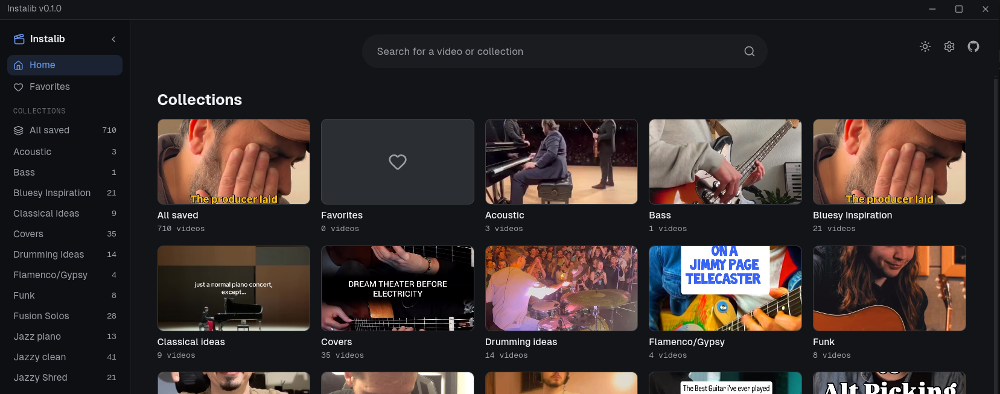
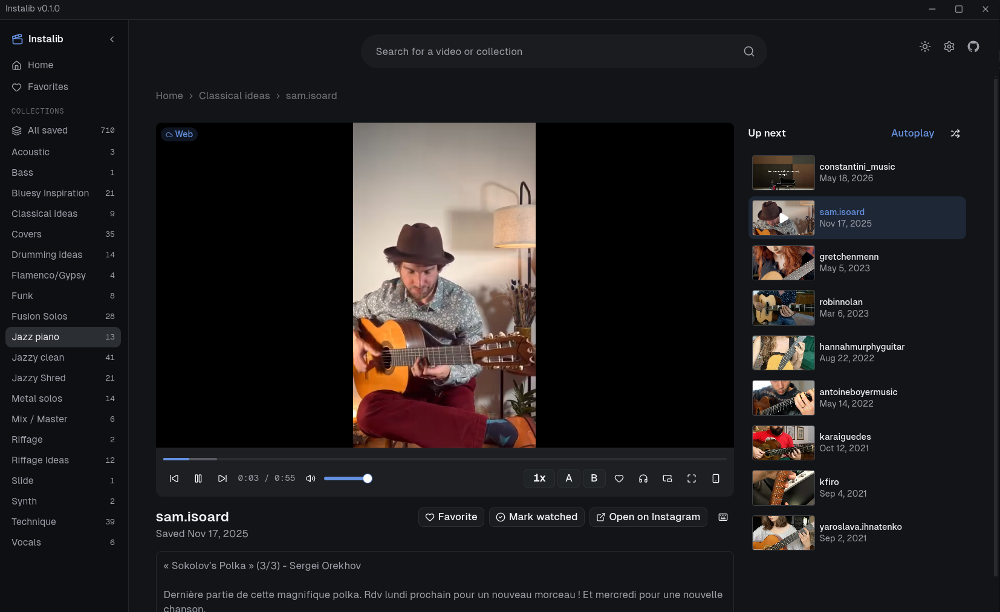

## What's this?

I am a musician, and most of the videos I save on Instagram are great instrument or mixing tutorials which I want to learn.

Unfortunately, relying on Instagram for this is terrible, since you have basically no control over the video, and managing your catalogue of saved videos is very frustrating.

Instalib allows you to import a collection of your `saved` videos from Instagram and have a better viewing and learning experience. 

It features things like:

- Downloading all or part of your collection for offline viewing (still works if you don't!)

- Picture-in-picture allowing you to keep organizing your library while watching the video

- Focus mode, which removes unnecessary clutter from the UI and expands the video

- Repeating a fixed section of the video

- Note taking

- Favorites

Think of this like your own personal Youtube for Instagram saved content, with a bunch of neat additions.

## Installation

1. Download the release file, run it from anywhere.

2. On the first run, SQLite (Database) will be set up, and `yt-dlp` + `ffmpeg` will download automatically.

Note that the app is unsigned, so it will be flagged by some OS the first time you open it:

* Mac: if the app does not open (unsigned, Gatekeeper), use `right-click → Open`. 
* Linux: run `chmod +x AppImage` first.
* Windows: Windows SmartScreen blocks it on the first run. Just click `More info → Run anyway`.

## Importing your saved collections

Instalib doesn't scrape your account - it reads the export file Instagram gives you when you ask for your own data. Here's how to get it and load it in.

**On Instagram:**

1. Open Instagram → Settings → Accounts Center → Your information and permissions → Export your information.
2. Choose Create export → Some of your information.
3. Scroll down and select just Saved. Instalib does NOT read anything else.
4. Set format to **JSON** and date range to **All time**, then submit.
5. Instagram will email you (usually within a few minutes, sometimes longer) with a download link.
6. Download the ZIP file. You don't need to unzip it.

**In Instalib:**

1. Open the app and drop that ZIP file onto the import screen (or use the file picker).
2. Wait for it to finish - it'll show how many videos were imported.
3. Your saved posts and collections show up in the library, organized the same way they were on Instagram. 

You can repeat this any time you save new things on Instagram - re-importing just adds what's new and skips what you already have.

Keep in mind that this list is completely detached from Instagram and syncs only by importing the ZIP file - you can remove collections at will and that will never affect your Instagram profile.

## Hand-shaking with Instagram

Being logged into Instagram in a browser isn't required for everything, but it helps. Public videos usually play and download fine without it. Private posts, or videos Instagram is temporarily blocking, however, will need it.

If you use this, Instalib reads the login cookie already sitting in your browser (Firefox, Chrome, etc.) and uses it to fetch the video - it does not log in for you, and you don't type any password into the app. No account info or credentials are ever stored or sent anywhere else.

**On Windows, Chrome (and Edge/Brave) encrypt cookies, so we can't use them. Use Firefox instead.**

If something can't be fetched, the app falls back to Instagram's own embedded player instead of failing outright.

## Forking it?

Read the [dev guide](docs/dev.md) for build and general development insights if you want to expand the app yourself.